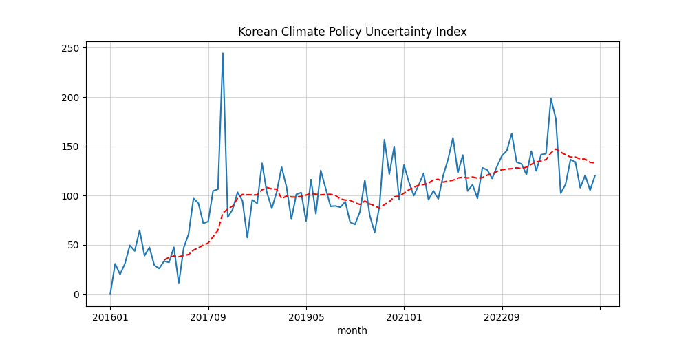

# Climate Policy Uncertainty Index 작업 코드

> 뉴스 데이터 기반 Climate Policy Uncertainty Index를 생성하는 예시 작업 코드 공유용 리포지토리입니다

### 구조

##### 파일

- `cpu_index_draft.ipynb`: 인덱스를 생성하는 코드
- `.config.db.json`: 뉴스 데이터가 저장된 PostgreSQL DB 접속 정보가 저장된 json 파일
- `psql.py`: PostgreSQL 데이터베이스 접속 및 쿼리 실행을 위한 모듈
- `index_cpu_draft.png`: 인덱스 plot
- `data_count.png`: 필터링한 뉴스데이터 count의 plot
- `data_ratio.png`: 필터링한 뉴스데이터 ratio의 plot
- `index_cpu.csv`: 생성한 CPU Index 데이터
- `monthly_count.csv`: 언론사-월별 필터링한 데이터 개수의 count

---

### CPU Index Example

- 현재 수집된 가장 최신 시점 데이터를 사용하여 제작한 인덱스입니다. (2024.04 기준 2016)
- 2006~7년 까지를 목표로 데이터 수집중이며 수집 완료 시 인덱스도 업데이트될 예정입니다.

---

### 참고문헌

- US Climate Policy Uncertainty Index: https://www.policyuncertainty.com/climate_uncertainty.html
